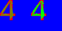

# gewellt-eight

'Gewellt' meaning 'wrinkly'... this code uses a genetic algorithim to optimize coverage of eight triangles
onto a freetype-rendered font glyph using very basic OpenGL. The approach creates scalable and compact glyphs,
 though a bit 'wrinkly'. Eight triangles are used, hence the name.

A freetype glyph-texture is drawn onto a back buffer along with alpha-blended candidate coverage triangles. The
 resulting render buffer is color-sampled to measure metrics of triangle coverage. These metrics 
are then used in the objective function to control breeding selection. As processing continues, the genetic
 algorithm uses a simple iteration-based schedule to switch the
 weights on the objective function coefficients. This approach
  appears to perform annealing / relaxation on the triangle fitting. It all works like a poor-man's opencl.

After 200 iterations, the drawing buffer is saved to a .png and the triangle positions are
emmitted. With triangle coordinates being only byte-values this makes 48 bytes per glyph. Character code
and the glyph metric information add a few more bytes.

While the process runs the left side are where triangle coverage is tested whereas the right side is there to show
what the best coverage looks like. Here is a real-time video (taken from an old Core2 laptop) of some glyphs
 being fitted:


The output after every glyph is a fixed-length structure comprising:

* the character-code (which in this case is ascii, but gewellt should be utf8 compatible)
* the freetype glyph metric information specifying dimensions, position and advance for horizontal and vertical layouts
* the triangle data. The coordinates are made of unsigned bytes but by default gewellt only uses a 6-bit coordinate system.

These are appended to a file:

```
{ '1', {31,42,4,42,38,-15,4,51,}, {17,33,31,41,0,41,0,11,0,7,4,11,21,28,14,34,14,12,8,11,8,11,18,10,1,11,2,6,1,8,0,8,13,4,7,11,19,0,11,0,20,26,7,0,17,0,11,0,} }
{ '2', {29,43,5,43,38,-14,4,51,}, {29,0,6,4,10,0,0,37,3,43,27,11,22,2,25,11,27,7,20,36,4,42,29,42,12,2,25,11,22,2,29,8,29,0,29,6,1,11,2,5,16,2,20,12,25,11,25,15,} }
{ '3', {30,44,4,43,38,-15,3,51,}, {10,2,15,2,8,3,17,4,6,3,2,8,27,16,28,7,20,17,30,28,12,44,26,40,5,7,10,7,0,11,30,10,22,1,7,1,29,30,20,17,10,21,0,32,14,41,8,42,} }
{ '4', {32,42,3,42,38,-16,4,51,}, {1,30,1,30,17,35,14,17,14,17,21,41,32,30,24,33,25,27,20,7,24,42,20,37,24,38,24,33,24,35,20,6,24,40,26,1,20,0,27,0,8,19,2,33,0,29,18,2,} }
{ '5', {30,43,4,42,38,-15,4,51,}, {30,37,25,17,21,21,7,18,14,27,1,10,0,31,3,39,19,43,10,16,5,22,25,17,27,30,13,42,27,38,8,6,26,3,23,0,5,24,7,6,2,11,22,0,3,0,2,9,} }
```

Individually, these glyphs look like this:





The little test app here is a simple one line text editor with a small gewellt-built glyph-set. OpenGL rendering
is done in 'immediate mode' style:


# The Genetic Algorithim

The GA used has seven parts - each new generation is produced using the following steps:

* preserve best
* combine best with one random vertex join between the 8 triangles
* combine best with limited-distance random vertex position adjustments
* combine best with limited-distance random triangle shifts
* crossover the best with any likely candidate from the previous generation
* unconstrained crossover with any likely candidates
* combine the best with any 2 randomly generated triangles

The crossover approach performs substitution of a contiguous subsection from two mates.

The objective function is calculated as the initial amount of background blue (ie without any triangles) minus
weighted penalty values. After a triangle-set is drawn (in alpha) the penality values are summed from
a sampling of the drawing surface:

* red - the amount of glyph still showing
* green_over_blue - the amount of unnecessary triangle coverage on the background
* green_over_green - the amount of overlapping triangles (only possible because we use alpha to draw triangles)
* badTri - the number of triangles that fail a simple size-test by being too small

The penalties for these terms are typically applied in decreasing weight (ie, red has the higest priority) but
the code uses a schedule based upon the iteration count to swap the weights between the terms for periods
of 10 iterations at a time - this appears to create most of the annealing effects you see in the above gif.
